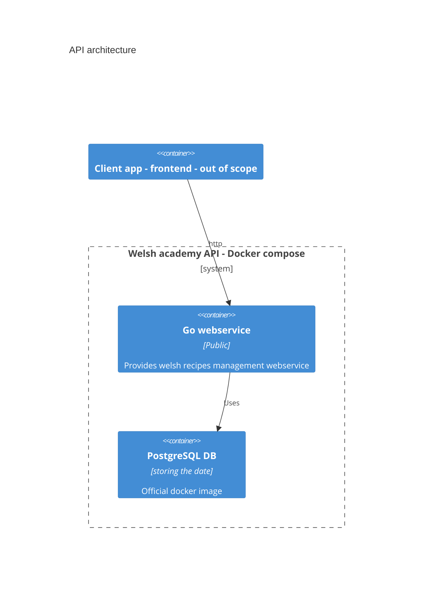
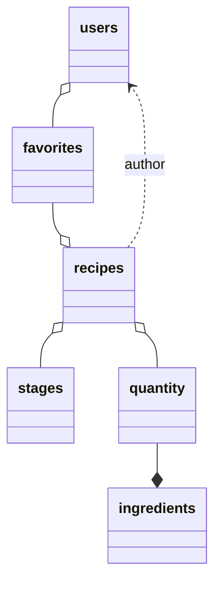

# welsh-academy
A welsh recipes management backend

## Requirements
- Docker
- Docker-compose
- Golang dev env (for building)

## Design
Implementation with the [go-zero framework](https://github.com/zeromicro/go-zero) and PostgreSQL.

### System architecture

Monolithic webservice with a PostgreSQL database. 

### Database schema

### Limitation
Not suitable for production : 
- no authorisation management
- no cache management

## How to deploy

## Usage

## Questions 
- how to specialize for welsh recipes only ? (business scenario)
    - **Easy** : validation process by admins or moderators
    - **Hard** : adding a constraint management in the system (typing ingredients and mandatory ingredients in each recipe) : but of
loss of flexibility for innovative recipes