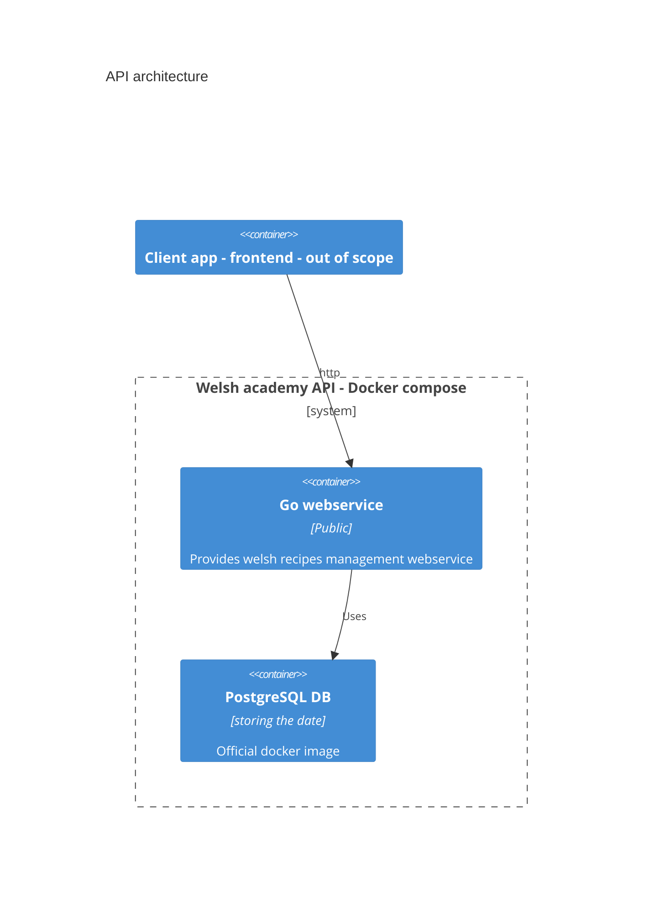
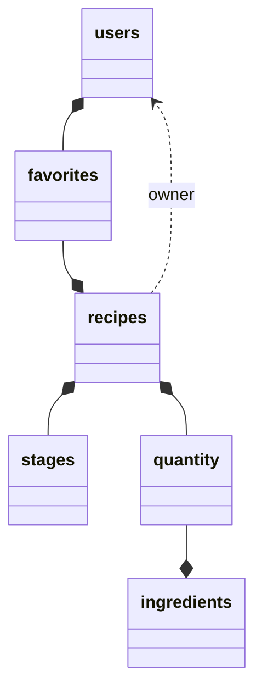

# welsh-academy
A welsh recipes management backend

## Requirements
- Docker
- Docker-compose
- Golang dev env (for building)

## Installation 

**First step :** retrieve the code of the repository (or only the `docker-compose.yml` for just a deployment).

### With docker-compose (preferred)

By default, the **api is on port 8888** and the **DB on port 5432**. Change the [docker-compose](docker-compose.yml) if needed.

Note : If you don't need access to the DB you should delete these lines :
```yaml
    ports:
      - 5432:5432
```

**Deploy with docker-compose :**
It will automatically pull the latest docker image from ghcr.io

```shell
docker-compose up
```

### Or manually

- You will need a **PostgresSQL service** accessible by the api and a **Golang compiler**
- Update the [configuration file](api/etc/welsh-academy-api.yaml) 
  of the API accordingly.
  - Change the Datasource string
  - And the port (default value : 8888)
- `go run welsh-academy.go`

#### Tests

To run all the tests :
`go test api/...`

## Usage

All the API specifications are in [welsh-academy.api](api/welsh-academy.api) :
The .api file contain all the json types for requests and replies.
The api should always return a valid Json response. 

Ingredients should be created before any usage in recipe.
Users and recipes should be created before adding favorite recipes.

API summary (maybe outdated) : 
```
get /ingredients
post /ingredient (json) returns (id & name)
get /recipes returns (list of recipe id & title)
post /filtered_recipes (json) returns (list of recipe id & title)
get /recipe/:recipe_id returns (full recipe)
post /recipe (json) returns (id and title)
post /favorite_recipe (json)
delete /favorite_recipe (json) # ko
get /favorite_recipes/:user_id returns (list of recipe id & title)
post /user (json) returns (user id & username)
```

Some examples, usable for creation : 
```
get /example_ingredient returns (creation json example)
get /example_recipe returns (creation json example)
```

## Design
Implementation with the [go-zero framework](https://github.com/zeromicro/go-zero) and PostgreSQL.

- Api specifications in [welsh-academy.api](api/welsh-academy.api)
  - You will find all the endpoints at the bottom of the file.

### System architecture

Monolithic webservice with a PostgreSQL database.



### Database schema


### Limitation
Not suitable for production : 
- no authorisation management
- no cache management
