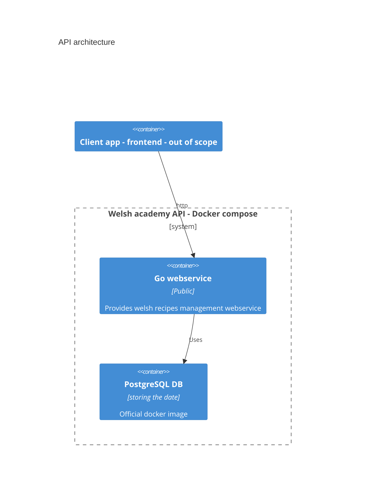
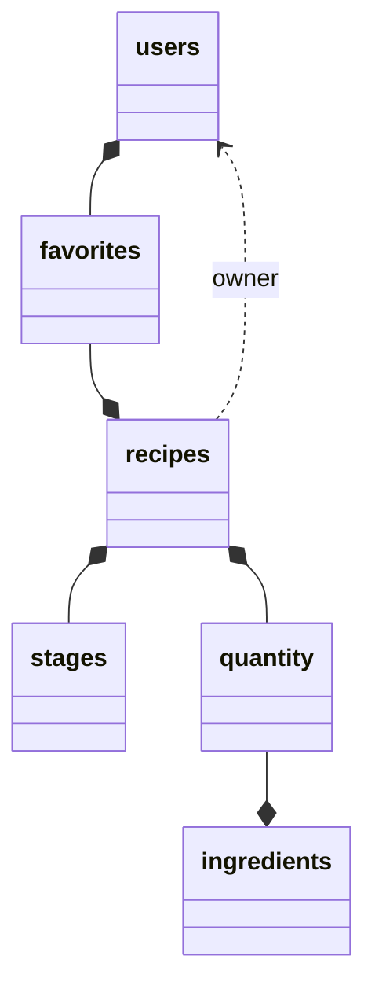

# welsh-academy
A welsh recipes management backend

## Requirements
- Docker
- Docker-compose
- Golang dev env (for building)

## Installation 

First step : retrieve the code of the repository (or only the `docker-compose.yml`).

### With docker-compose (preferred)

By default, the **api is on port 8888** and the **DB on port 5432**. Change the [docker-compose](docker-compose.yml) if needed.

Note : If you don't need access to the DB you should delete these lines :
```yaml
    ports:
      - 5432:5432
```

**Deploy with docker-compose :**
It will automatically pull the latest docker image from ghcr.io

```shell
docker-compose up
```

### Or manually

- You will need a **PostgresSQL service** accessible by the api and a **Golang compiler**
- Update the [configuration file](api/etc/welsh-academy-api.yaml) 
  of the API accordingly.
  - Change the Datasource string
  - And the port (default value : 8888)

## Tests

To run all the tests :
go test ./...


## Design
Implementation with the [go-zero framework](https://github.com/zeromicro/go-zero) and PostgreSQL.

- Api specifications in [welsh-academy.api](api/welsh-academy.api)
  - You will find all the endpoints at the bottom of the file.

### System architecture

Monolithic webservice with a PostgreSQL database.



### Database schema


### Limitation
Not suitable for production : 
- no authorisation management
- no cache management

## How to deploy

## Usage

## Questions 
- how to specialize for welsh recipes only ? (business scenario)
    - **Easy** : validation process by admins or moderators
    - **Hard** : adding a constraint management in the system (typing ingredients and mandatory ingredients in each recipe) : but of
loss of flexibility for innovative recipes